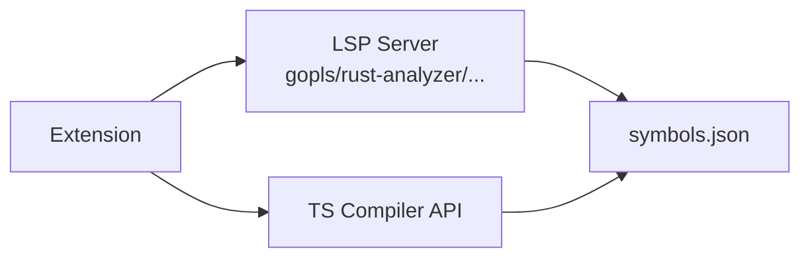

# pi-symbol-index

A Pi coding agent extension that builds and exposes a **symbol index** for Go, TypeScript, Rust, Python, C/C++, and other languages. Uses LSP servers or compiler APIs to extract code symbols.

## What it does

When the model works on a project, it often needs to find:
- Where a symbol is **defined** (function, class, struct, interface)
- Where a symbol is **used** (call/reference locations)
- A **high-level overview** of the project

Without this extension, the model has to read multiple source files, grep manually, or hallucinate. **pi-symbol-index replaces all of that with structured data.**

## Registered tools

### `symbol_index_build(target?)`

Builds the symbol index by:
1. Detecting the project language (Go, TypeScript, Rust, Python, C/C++)
2. Spawning the appropriate LSP server (gopls, rust-analyzer, etc.) or using compiler API
3. Scanning project files
4. Querying `textDocument/documentSymbol` for definitions
5. Querying `textDocument/references` for usages
6. Writing the index to `.pi-index/symbols.json`

### `symbol_index_info(name)`

Looks up a symbol across the project. Returns:
- File location
- Line range
- Container type
- Usages (where it's referenced)
- Call hierarchy (incoming/outgoing calls)

### `symbol_index_symbols()`

Shows a high-level summary of:
- Files scanned
- Symbol counts by file
- Types and functions found

### `symbol_index_replace_block(file, shortId, newText)`

Replace a code block by short hash ID. No `oldText` required — the extension finds the block by hash. If the hash check fails (file was modified externally), the operation is refused to prevent desync.

### `symbol_index_list_blocks(file?)`

Lists all editable blocks in a file (or all files) with their short hash IDs.

## Configuration

Language support is configured via `pi-symbol-index.json` in the extension directory:

```json
{
  "languages": {
    "go": {
      "server": "gopls",
      "args": ["serve"],
      "env": { "GOFLAGS": "" },
      "detect": ["go.mod"],
      "extensions": [".go"],
      "symbolKindMap": {
        "function": "function",
        "method": "method",
        "struct": "struct",
        "interface": "interface"
      }
    },
    "rust": {
      "server": "rust-analyzer",
      "args": ["--stdio"],
      "detect": ["Cargo.toml"],
      "extensions": [".rs"],
      "symbolKindMap": { ... }
    }
  }
}
```

Each language entry specifies:
- `server`: LSP server binary name
- `args`: Arguments to pass to the server
- `env`: Environment variables to set
- `detect`: Files that indicate this language is present
- `extensions`: File extensions to scan
- `symbolKindMap`: Mapping of LSP SymbolKind to display names

To add a new language, just add an entry to the config file — no code changes needed.

## Architecture



### TypeScript Support

TypeScript uses the compiler API (`ts.createProgram`) instead of LSP, because `typescript-language-server` requires a `tsserver` binary which Linux TypeScript packages don't ship.

## Development

```bash
# In pi-symbol-index/
npm install

# Run unit tests
npx tsx test.test.ts

# Test with a Go project
cd /path/to/go-project
timeout 90 pi -p 'Run pi_symbol_build. Then run pi_project_symbols.'
```

## Tests

17 unit tests covering:
- Index build/read (Go and TypeScript)
- Symbol extraction (functions, classes, structs, interfaces)
- Line ranges and usages
- Call hierarchy
- Block hashing (SHA256)
- Config-driven detection
- Hash mismatch detection

## Known issues

- References may fail for symbols LSP servers don't fully resolve
- Call hierarchy may not be supported by all LSP servers

## Future work

- [ ] Add more LSP servers (pyright, clangd, etc.)
- [ ] Session keepalive (reuse LSP connection across multiple sessions)
